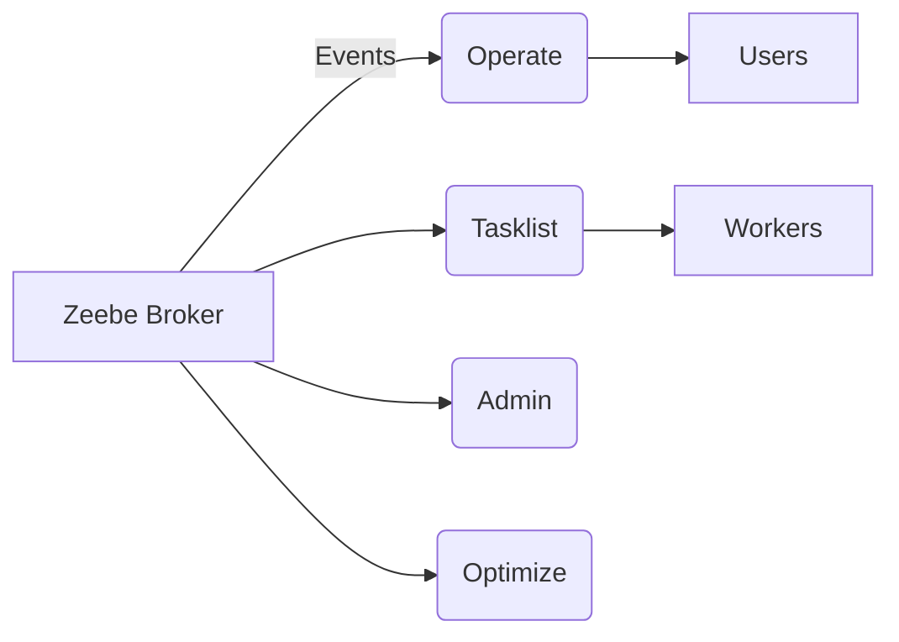

# Camunda 8 Architecture Overview

Camunda 8 is composed of:

- **Zeebe Broker:** Core workflow engine, event streaming.
- **Operate:** Visualize instances, incidents.
- **Tasklist:** Manage human tasks.
- **Admin:** Identity, multi-tenancy.
- **Optimize:** Reporting, analytics.

> Diagram source: https://docs.camunda.io/docs/reference/components/architecture
