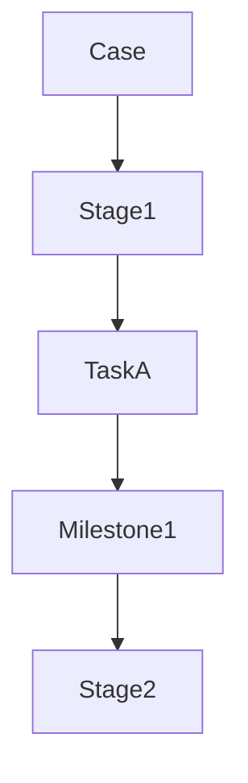

# CMMN Fundamentals & Case Modeling

- **Elements**: Case, Stages, Tasks, Milestones
- **Sentries**: OnPart, IfPart
- **Plan Models**: Auto-completion vs Manual

```mermaid
flowchart TB
  Case --> Stage1 --> TaskA
  TaskA --> Milestone1
  Milestone1 --> Stage2
```
