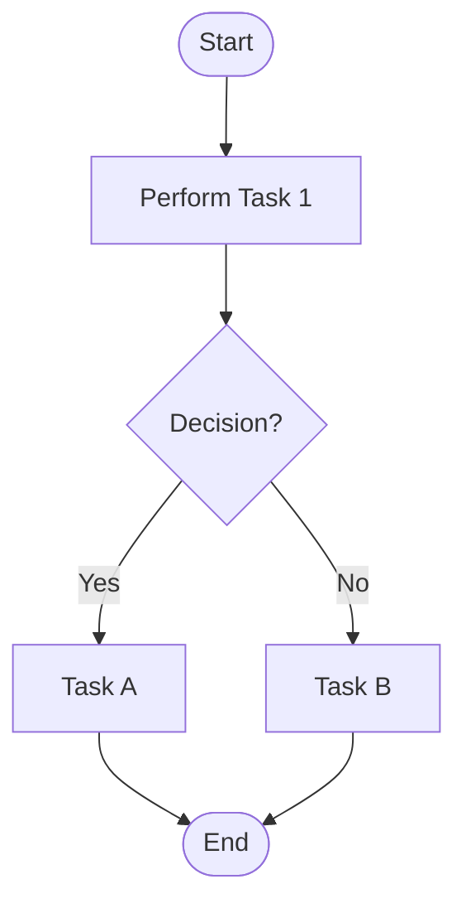
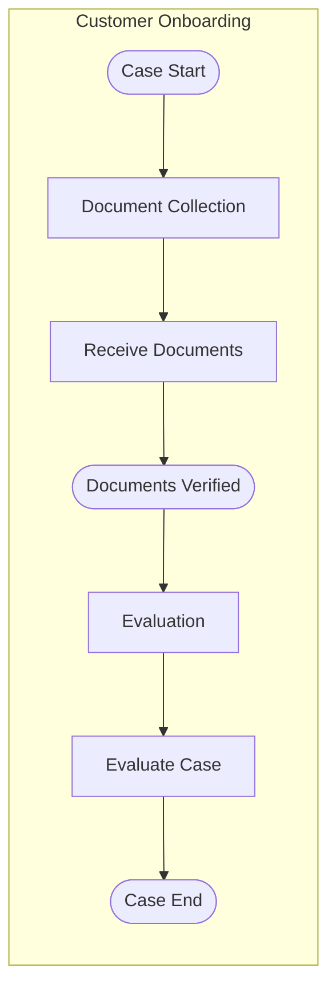

# Modeling Diagrams Reference for Camunda 8

This guide provides **Mermaid** diagrams and examples to aid in creating, reviewing, and updating models.

## 1. BPMN Diagram Patterns

## 2. DMN Decision Table Illustration
Although Mermaid doesn't natively render tables, represent DMN as Markdown:

| Condition         | Result      |
|-------------------|-------------|
| `input < 100`     | `Low`       |
| `input >= 100`    | `High`      |
| `input == null`   | `Unknown`   |

Use this table when prompting GPT to **generate** or **review** DMN models.

## 3. CMMN Case Model Structure

